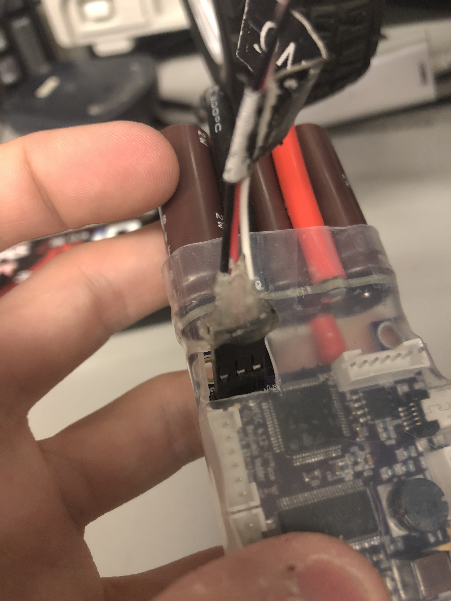
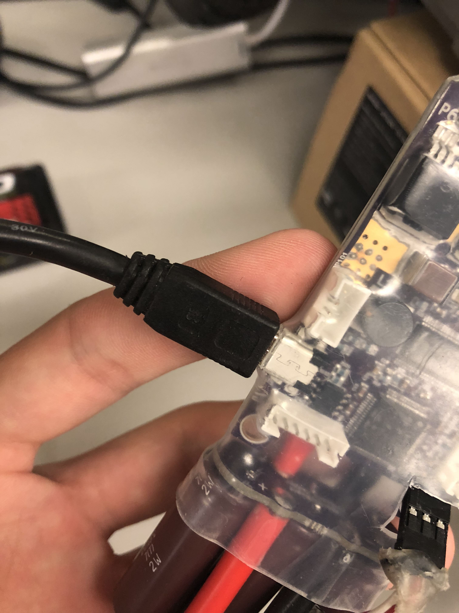
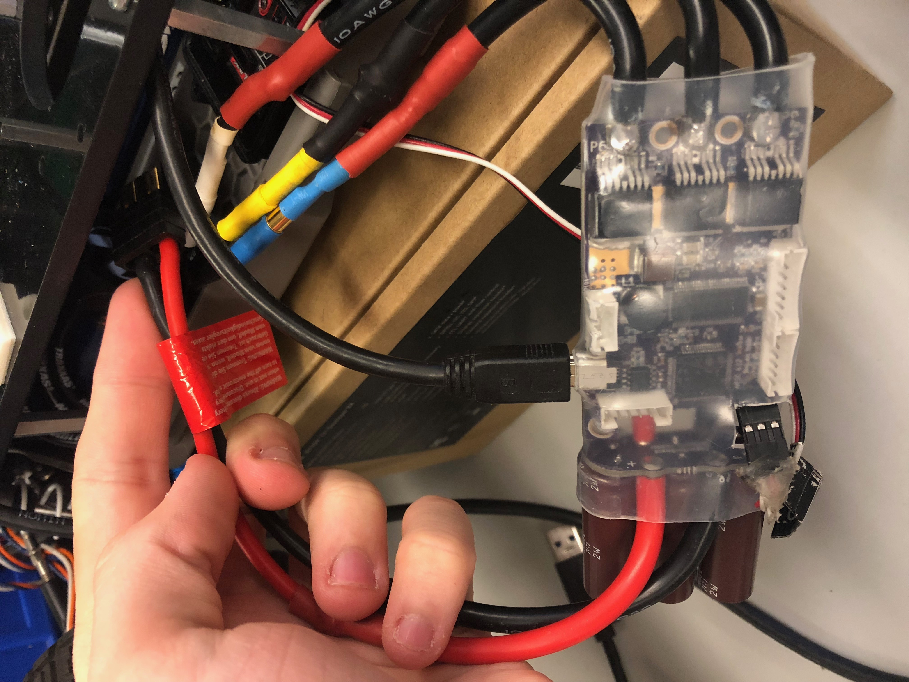

# f110-vesc-docs
Documentation for setting up the VESC 4 on the F1/10 platform

# Hardware Setup
Before you begin, make sure you have the following items:
- Traxxas RC Car. This should also come with a servo motor (for steering) and a motor for driving the wheels. You'll need to connect both motors to the VESC later.
- VESC 4 electronic speed controller
- Traxxas 11.1v LIPO or NiMH battery
- Battery connector (splitter)
- Power distribution PCB
- Mini USB cable
- USB hub

Begin by connecting the drive motor to the VESC. The motor has three color-coded connections that correspond with connections on the VESC.

Next, connect the steering servo motor to the three-pin unshrouded male header on the VESC. Pay attention to the orientation of the servo connector since it is possible (and quite easy!) to plug the servo in backwards. If the VESC is oriented with the three-pin header at the top left, as pictured, the black wire should go on the left, the red in the middle, and the white on the right.

Plug the USB cable into the USB port of the VESC. Pull the other end of this cable through the oval-shaped cutout on the top right of the car chassis, and plug this into the USB hub. Plug the USB hub into the Jetson on the car if it is not already connected.

The VESC should be on the right side of the chassis. Pull the 2-pin VESC battery connector through the chassis from the right side to the left side, and tuck the VESC in the right side of the car between the bottom of the car and the laser-cut chassis.

Connect the VESC battery connector to the battery splitter, and connect the white 4-pin header on the battery splitter to the corresponding header on the power distribution PCB. Ensure that the large silver toggle switches U$3, U$4, and U$5 on the power board are OFF (toggled towards the white battery header).

Plug the battery into the remaining end of the splitter, and tuck the battery into the left side of the chassis.

At this point, the hardware should be set up, and you can turn the car on by toggling switch U$3 on the power board.
